# Reporte Práctica 1 - Alejandro Espino Gutiérrez


## Mínimo Viable en Clase

Primero creamos el repositorio en Github, asegurándonos que sea público:

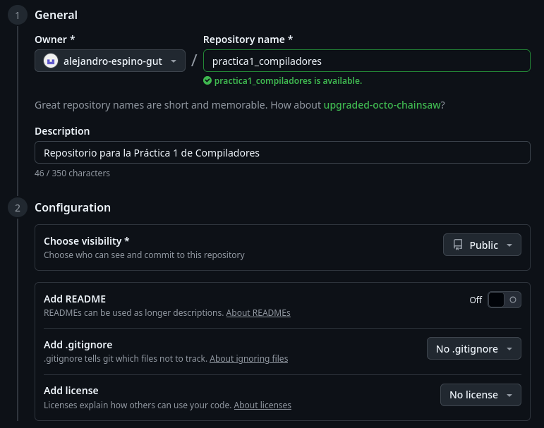

Creamos un directorio para el proyecto y luego un README.md:

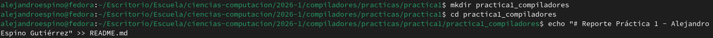

Procedamos a hacer el `git init` y el primer commit usando "feat:" para indicar la adición de una funcionalidad:

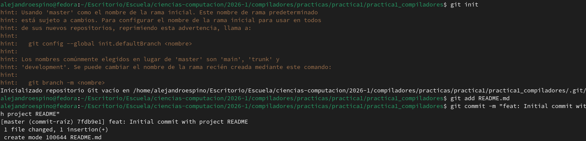

Ahora conectemos el repositorio local con el remoto en GitHub:

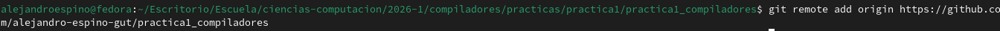

Ahora subamos los cambios a Github:

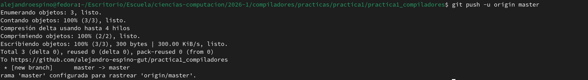

Ahora si vamos al enlace al repositorio de Github podemos ver los cambios:

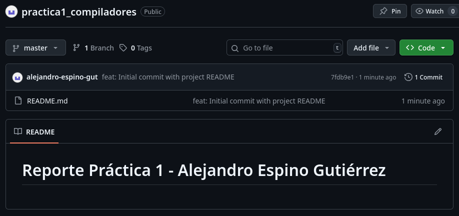

## Configuración Profesional

### Licencia

La importancia de la licencia es que ésta define los derechos y limitaciones del uso del código, pues ésta indica qué puede hacer alguien más con el código y bajo qué condiciones. Es muy importante a la hora de hacer código abierto, pues si no se incluye una licencia, el código se considera con todos los derechos reservados. 

Para ésta práctica decidí usar la licencia MIT debido a que no genera ninguna responsabilidad legal por parte del autor y autoriza la libre difusión del código.

Creemos el archivo `LICENSE`, copiamos el texto de choosealicense.com y reemplazamos año y nombre:


Ahora subamos el cambio:

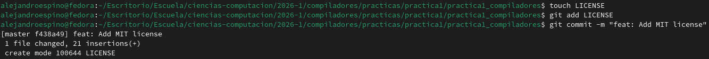

Y procedemos a hacer el `git push`:

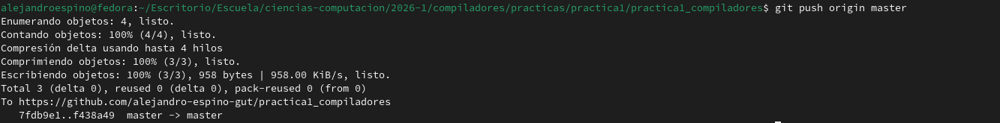

### gitignore

El `.gitignore` es fundamental para tener un repositorio limpio y ordenado, porque permite seleccionar archivos y directorios innecesarios como archivos compilados, configuraciones locales o archivos temporales y excluirlos del repositorio. De ésta forma queda en el repositorio sólo el código que es necesario.

Creamos el `.gitignore` y lo abrimos:

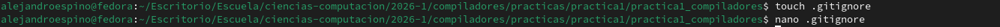

Escribimos en el `.gitignore` los archivos que se quieren excluir (compilados y logs):

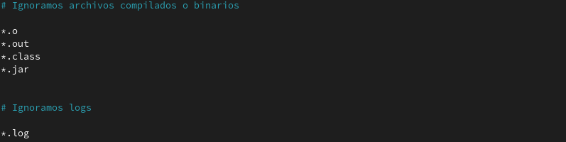

Finalmente subimos el cambio:

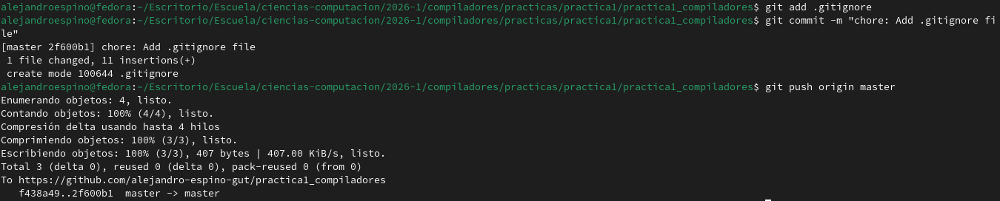

Y ahora nuestro repositorio se ve así:

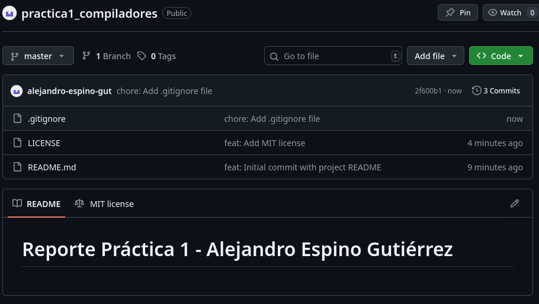

## Buenas Prácticas

### Commits Semánticos

Los Commits Semánticos son una convención para escribir mensajes en Commits de Git, la cual se usa para tener un historial de commits altamente legible y ayuda a otros desarrolladores a entender los cambios que se hacen al repositorio. Se compone de un tipo y una descripción breve, ambos escritos en inglés. Los tipos son: 

* feat
* fix
* docs
* style
* refactor 
* test
* chore

Entonces un ejemplo de un commit usando ésta convención sería 

```
feat: Add MIT License
```

Podemos observar que tiene `feat:` para describir la adición de una nueva funcionalidad, seguido de una descripción breve y específica.

### Logs

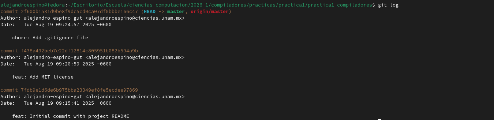

**Link del Repositorio:** https://github.com/alejandro-espino-gut/practica1_compiladores.git

## Desafío Técnico Opcional

Primero modifiquemos el README:

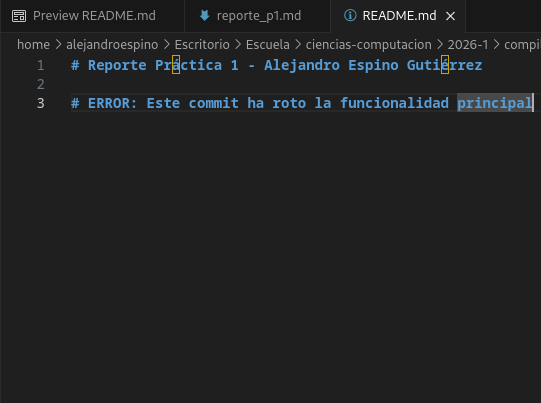

Ahora subamos el cambio:

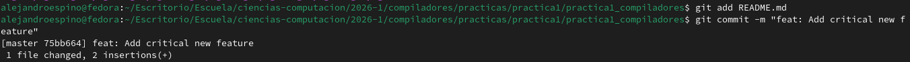

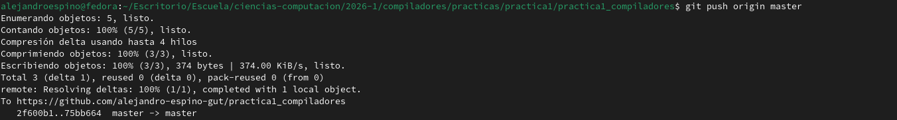

Veamos el log actual:

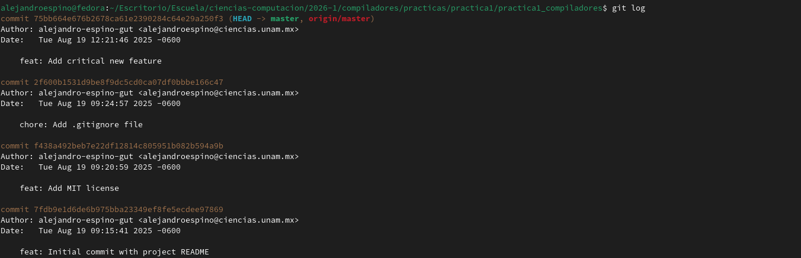

### Investigación de la solución

`git reset` sirve para regresar el estado actual del repositorio a un commit anterior y puede borrar los cambios hechos **dependiendo del modo en que se use**. Los cinco modos de uso son:

* --soft: No reestablece el index ni el working tree, sólo mueve el HEAD al commit objetivo.

* --mixed: Mueve el HEAD y reestablece el index para que coincida con el commit objetivo, pero no modifica el working tree.

* --hard: Mueve el HEAD, reestablece el index y modifica el working tree para que todo quede como en el commit objetivo.

* --merge: Restablece el index y modifica en el working tree los archivos que difieren entre el commit y el HEAD, pero mantiene los que son diferentes entre el index y el working tree

* --keep: Reestablece las entradas del index y modifica en el working tree los archivos que difieren entre el commit y el HEAD, pero si un archivo que es diferente entre el commit y el HEAD tiene cambios locales, el reset se aborta.

Un ejemplo de uso es el siguiente
``` 
git reset --hard HEAD~3
```

`git revert` crea un nuevo commit nuevo deshaciendo los cambios realizados por un commit anterior, evitando así sobreescribir el historial de commits.

Los modos de uso principales son:

* -e: Abre editor de texto y permite editar el nuevo mensaje de commit

* --no-edit: No abre el editor de texto

* -n: Deshace los cambios del commit anterior y los añade al index.

Un ejemplo de uso es el siguiente
``` 
git revert -n master~5..master~2 
```

### Peligro de git reset

`git reset` es peligroso en ramas compartidas debido a que puede sobreescribir el historial de la rama, pero si esa rama ya fue publicada y otros desarrolladores tienen la versión que fue sobreescrita, se genera una inconsistencia, por lo que al ellos hacer `git pull` tendrán errores y deberán forzar cambios locales, por lo que se pueden perder commits importantes. Ésto se puede evitar si se usan ramas distintas para el desarrollo y al terminar se hace un merge a la rama main/master.

### Aplicación a nuestro caso

Para revertir nuestro último commit, podríamos usar ambas opciones debido a que no estamos en una rama compartida con otros desarrolladores, pero la opción más segura sería `git revert`, ya que no alteramos el historial y si estuviéramos en una rama compartida, no tendríamos riesgo de inconsistencias como explicamos en el párrafo anterior y además dejamos un registro claro de la corrección en el historial.

### Aplicación

Ejecutamos lo siguiente

```
git revert HEAD
```

Y dado que la opción predeterminada es `-e` nos abre el editor de texto en la terminal:


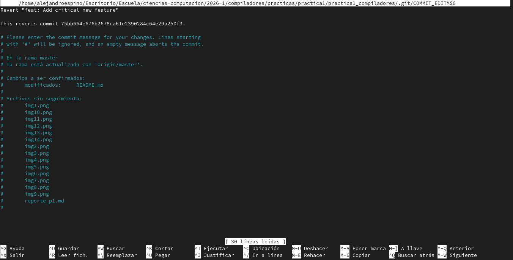

Modificamos el mensaje del commit para seguir la convención de Commits Semánticos:


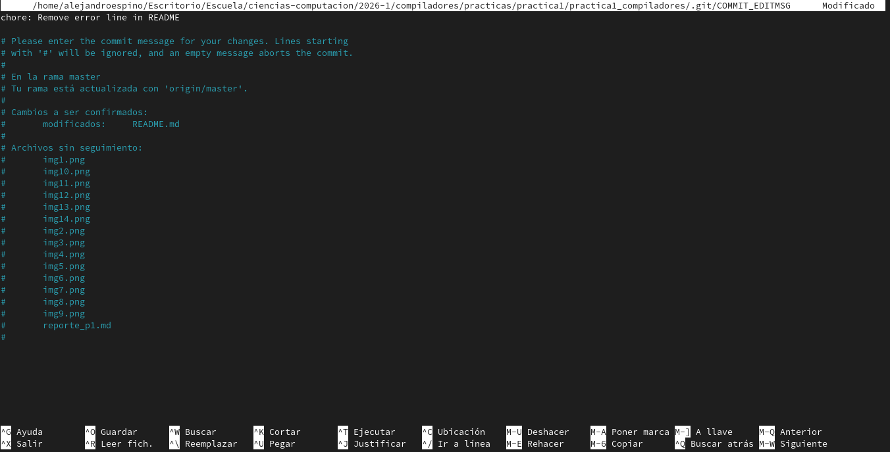

Así se ve el comando tras terminar ésto:


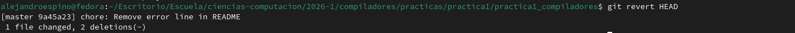

Hagamos push al cambio:

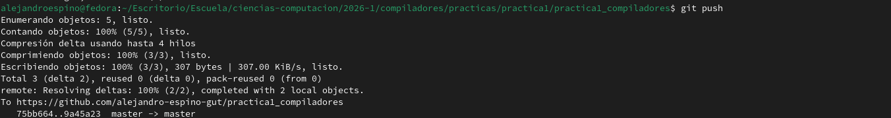

Y así quedan los logs:

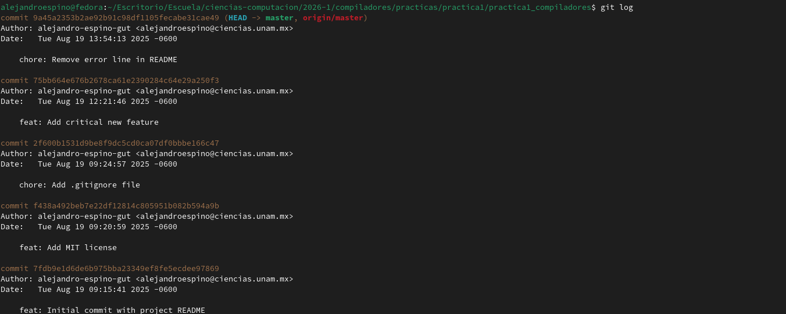

### Reflexión

Saber manejar errores en un flujo de trabajo colaborativo es fundamental ya que si algún día nos llegamos a equivocar al subir algo a un repositorio, podemos arreglarlo sin afectar al resto del equipo y sin perder código importante al elegir la mejor estrategia para reparar el error y posteriormente documentarlo para no volverlo a repetir. Sabiendo manejar este tipo de errores y con una buena comunicación en el equipo de trabajo, se puede tener una alta eficiencia y evitar bastantes errores que pueden surgir durante el trabajo colaborativo.

# Versión en Inglés

## Minimum Viable in Class

First we create the repository on Github, making sure that it is public:


We create a directory for the project and then a README.md:


Let's proceed to do the `git init` and the first commit using "feat:" to indicate the addition of a feature:


Now let's connect the local repository to the remote one on GitHub:


Now let's upload the changes to Github:


Now if we go to the link of the Github repository we can see the changes:


## Professional Configuration

### License

The importance of the license is that it defines the rights and limitations of the code's use, as it indicates what someone else can do with it and the conditions for it. This is very important when creating open source code, because if a license is not included, the code is considered with all rights reserverd. 

For this practice, I decided to use the MIT license because it does not generate any legal responsability on the author and authorizes the free distribution of the code.

Let's create the `LICENSE` file, copy the text from choosealicense.com and replace the year and name:


Now let's upload the change:


And let's do the `git push`:


### gitignore

The `.gitignore` is essential for a clean and organized repository because it allows you to select unnecessary files and directories, such as compiled files, local configurations, or temporary files and exclude them from the repository. This way, only the necessary code remains in the repository.

Let's create the `.gitignore` and open it:


We write in the `.gitignore` the files we want to exclude (compiled files and logs):


Finally we upload the change:


And now our repository looks like this:


## Good Practices

### Semantic Commits

The Semantic Commits are a convention for writing Git commit messages. They are used to maintain a highly understandable commit history and help other developers understand changes made to the repository. They consist of a type and a brief description, both written in English. The types are: 

* feat
* fix
* docs
* style
* refactor 
* test
* chore

So an example of a commit using this convention would be 

```
feat: Add MIT License
```

We can see that it has `feat:` to describe the addition of a new feature, followed by a short and specific description.

### Logs


**Link of the Repository:** https://github.com/alejandro-espino-gut/practica1_compiladores.git

## Optional Technical Challenge

First let's modify the README:


Now let's upload the change:


Let's see the current log:


### Solution Reasearch

`git reset` is used to return the current state of the repository to a previous commit and can erase changes **depending on the mode in which it is used**. The five modes are:

* --soft: It does not reset the index or the working tree, it only moves the HEAD to the target commit.

* --mixed: Moves the HEAD and resets the index to match the target commit, but does not modify the working tree.

* --hard: Move the HEAD, reset the index, and modify the working tree so that everything is as it was in the target commit.

* --merge: Resets the index and modifies the files in the working tree that differ between the commit and the HEAD, but keeps the files that are different between the index and the working tree.

* --keep: Resets index entries and modifies files in the working tree that differ between the commit and HEAD, but if a file that is different between the commit and HEAD has local changes, the reset is aborted.

A usage example is the following:
``` 
git reset --hard HEAD~3
```

`git revert` creates a new commit, reverting changes made by a previous commit, and avoiding overwriting the commit history.

The main usage modes are:

* -e: Opens text editor and allows to edit the new commit message

* --no-edit: The text editor does not open

* -n: Reverts the changes from the previous commit and adds them to the index.

A usage example is the following:
``` 
git revert -n master~5..master~2 
```

### Danger of git reset

`git reset` is dangerous on shared branches because it can overwrite the branch's history. However, if that branch has already been published and other developers have the version that was overwritten, it creates an inconsistency. When they do `git pull`, they will encounter errors and have to force local changes, and can loose important commits. This can be avoided by using separate branches for development and merging them to the main/master branch when done.

### Application to our case

To revert our last commit, we could use both options since we are not on a shared branch with other developers, but the safest option would be `git revert`, since we are not altering the history and if we were on a shared branch, we would not have the risk of inconsistencies as explained in the previous paragraph and we also leave a clear record of the correction in the history.

### Application

We run the following:

```
git revert HEAD
```

And since the default option is `-e` it opens the text editor in the terminal:


We modify the commit message to follow the Semantic Commit convention:


This is what the command looks like after finishing this:


Let's push the change:


And this is how the logs look like:


### Reflection

Knowing how to handle errors in a collaborative workflow is essential because if we ever make a mistake when uploading something to a repository, we can fix it without affecting the rest of the team and without losing important code by choosing the best strategy to fix the error and then documenting it so it doesn't happen again. Knowing how to handle these types of errors and with good communication in the team can lead to high efficiency and avoid many of the errors that can come up during collaborative work.
